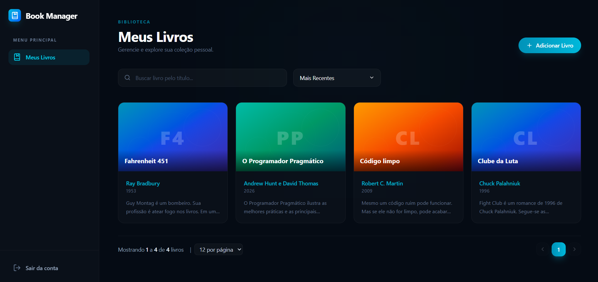

# Book Manager - Full Stack Challenge

<div align="center">
  
</div>

Esta é uma plataforma desenvolvida como resolução de um desafio técnico para gerenciamento de livros. A ideia principal por trás do projeto foi manter uma arquitetura limpa e escalável, separando a API RESTful e a interface web em ambientes isolados, mas orquestrados juntos usando Docker para facilitar a execução e avaliação.

## Tecnologias e Arquitetura

O sistema é dividido em duas frentes. Caso queira se aprofundar nos detalhes técnicos de cada stack, deixei documentações específicas preparadas:

* [Acesse a Aplicação em Produção (Vercel) ➔](https://book-manager-isnr.vercel.app/)
* [Acesse o Swagger da API em Produção (Render) ➔](https://book-manager-backend-pys9.onrender.com/swagger-ui.html)
* [Documentação do Backend (API) ➔](./backend/README.md)
* [Documentação do Frontend (Interface) ➔](./frontend/README.md)
* [Postman Collection para Testes ➔](./docs/book-manager-collection.json)

## Quick Start com Docker

O projeto foi totalmente containerizado usando multi-stage builds. Isso significa que você não precisa instalar Node, Java ou MySQL na sua máquina para rodar o sistema.

1. Clone o repositório:
```bash
git clone https://github.com/SEU-USUARIO/book-manager-desafio-full-stack.git
```

2. Suba a infraestrutura na raiz do projeto:
```bash
docker-compose up -d --build
```

3. Acesse os serviços localmente:
* Frontend: http://localhost:5173
* Swagger (Documentação da API): http://localhost:8080/swagger-ui.html

## Diferenciais da Implementação

Durante o desenvolvimento, me preocupei em trazer práticas de mercado para o projeto, incluindo:
* Orquestração limpa de containers com Docker Compose.
* Isolamento de escopo por usuário (Multi-tenancy): seus livros pertencem apenas à sua conta.
* Documentação interativa e aberta da API usando OpenAPI/Swagger.
* Paginação nativa com filtros otimizados ocorrendo direto no banco de dados.
* Tratamento de falhas de rede no frontend (incluindo cold-starts da API em serviços gratuitos).
* Deploy funcional contínuo da aplicação e do banco de dados na nuvem.
